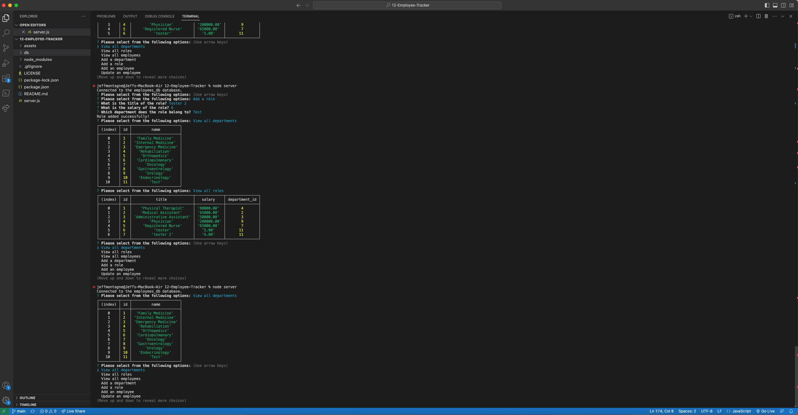

# 12-Employee-Tracker

  
  
    

  ## Table of Contents

  * [Description](#description)
  * [Installation](#installation)
  * [Usage](#usage)
  * [MIT](https://choosealicense.com/licenses/MIT)
  * [Contributing](#contributing)
  * [Tests](#tests)
  * [Questions](#questions)
  
  ## [Description](#table-of-contents)

  This application allows users to manage employee data via Node.js, Inquirer, and MySQL. Options include viewing departments, roles, and employees with accompanying info. Users will also be able to add onto exisiting departments, roles, and employees with an additional option to update existing employee information. 

  ## [Installation](#table-of-contents)

  To utilize the application, first install Node.js, Inquirer, and MySQL. Then fork the project repository to your local machine. Use the command "npm i" in the command line. Then navigate to the db and enter "mysql -u root -p" into the command line. Enter your personal MySQL password. Next, enter "SOURCE schema.sql" and then "SOURCE seeds.sql" to create and seed the employee database in MySQL. 

  ## [Usage](#table-of-contents)

  Once the application begins, you will be prompted to choose an action after entering "npm start" into the terminal. Select the desired task and follow any subsequent prompts. Once complete, choose the next desired task or choose "No action" to exit the application. Reference the provided video demonstration if necessary. 

  [Video Demonstration] 

  

  ## [License](#table-of-contents)

  The application is covered under the following license:
    
    
  [MIT](https://choosealicense.com/licenses/MIT)
    
    

  ## [Contributing](#table-of-contents)

  Assistance provided by Andres Long through Web Development Tutors at Team Calendly.

  ## [Tests](#table-of-contents)

  N/A

  ## [Questions](#table-of-contents)

  Please contact me using the following links:

  [GitHub](https://github.com/Tagne13)

  [Email: Tagne13@gmail.com](mailto:Tagne13@gmail.com)
